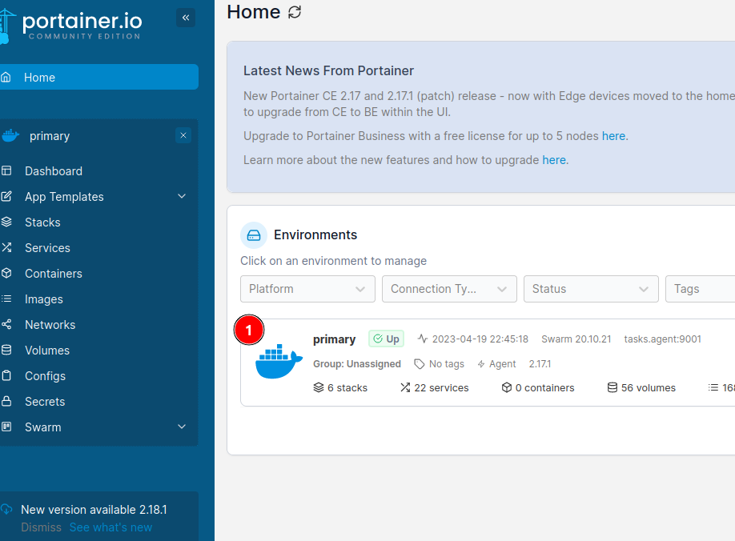

# Gitlab runner per CI

## Per què?

- Automatitzar la creació, les proves, el desplegament i altres tipus de tasques mitjançant ganxos de git, a nivell de repositori
    - desprès de un `git push`, desprès de *Merge*, etc.
    - En una branca específica
    - reintentar tasques _n_ times

## Engegar el servei des de portainer

- el runner es un contenidor de docker, i per tant, ho podem aixecar des de el servei de portainer en https://portainer.somenergia.coop




- (1) es un token que se obtè des de gitlab. Més arreu de aixó després
- (2) es el nom del runner, fer servir  `somenergia-<it|dades|etc>-runner-<n>`  per tasques generals o qualsevol altre depenent de la tasca
- (3) es una llista de tags. Els tags es fan servir dins de cascuna de les tasques de CI per dirigirles a un runner specific

## Obtenir un token des de gitlab

es pot registrar diferents tipus de runners

- runners compartits per a tothom
- runners a nivell de grup
- runners a nivell de repositori

### group runners

[https://gitlab.somenergia.coop/groups/IT/-/runners](https://gitlab.somenergia.coop/groups/IT/-/runners)


## Registrar runner

- la manera actual es mitjançant la eina CLI `gitlab-runner` dins del runner
- el runner encara no permet una configuraciò abans de engegar el contenidor, com ara per aixecar-ho dins de un cluster de kubernetes
    - algunes opcions son
    - [https://stackoverflow.com/questions/54658359/how-do-i-register-reregister-a-gitlab-runner-using-a-pre-made-config-toml](https://stackoverflow.com/questions/54658359/how-do-i-register-reregister-a-gitlab-runner-using-a-pre-made-config-toml)
    - [https://docs.gitlab.com/runner/register/#runners-configuration-template-file](https://docs.gitlab.com/runner/register/#runners-configuration-template-file)


verify runner handshake at [https://gitlab.somenergia.coop/groups/IT/-/runners](https://gitlab.somenergia.coop/groups/IT/-/runners)

# Fer que un runner agafi una tasca de CI

- fer-li una ullada al repository [https://gitlab.somenergia.coop/IT/ci-cd-playground-dades](https://gitlab.somenergia.coop/IT/ci-cd-playground-dades) per exemples
- mirar quins runners disponibles hi ha i quins tags porten


- mirar els runners disponibles en (2)
    - (3) es un runner de grup
    - (4) son els runners disponibles només per el project. Encara no hi ha cap
    - (5) porta els runners compartits, si hi ha cap
    - (6) pots bloquejar l’utilització de runners compartits
- crea un `.gitlab-ci.yml` en el teu projecte


- afegeix tasques dins de aquest fitxer
    - mirar el repository de exemple
- fes coincidir els tags de la tasca amb aquells del runner. es a dir, el runner pot tenir el tag `somenergia-it`


- i les tasques han de tenir aquest tag
    
    ```bash
    build-job: # This job runs in the build stage, which runs first.
      stage: build
      script:
        - echo "Compiling the code..."
        - echo "<h1>Hi there again, I'm a build job at $CI_COMMIT_SHA! This time from inside a container!</h1>" > $CI_PROJECT_DIR/dist/index-docker.html
        - echo "Compile complete."
      artifacts:
        paths:
          - $CI_PROJECT_DIR/dist/*
      tags:
        - somenergia-it # THIS TAG MUST MATCH WITH THOSE OF THE RUNNER
    ```
    
- afegeix variables de entorn, si hi ha cap
    - les mes importants son per fer conexiò mitjançant SSH, com ara `SSH_PRIVATE_KEY` i `SSH_PUBLIC_KEY`. Llegeix mes en [https://docs.gitlab.com/ee/ci/ssh_keys](https://docs.gitlab.com/ee/ci/ssh_keys/)
    
    
    
- fes `git push` amb els teus canvis
- verifica que el build estigui okay


- altre manera es fent servir `glab ci view` ([https://gitlab.com/gitlab-org/cli/](https://gitlab.com/gitlab-org/cli/))
    
    
    

## Referencies

1. [https://docs.gitlab.com/ee/ci/ssh_keys/](https://docs.gitlab.com/ee/ci/ssh_keys/)
2. [https://testdriven.io/blog/gitlab-ci-docker/](https://testdriven.io/blog/gitlab-ci-docker/)
3. [https://stackoverflow.com/collectives/articles/71270196/how-to-use-pre-commit-to-automatically-correct-commits-and-merge-requests-with-g](https://stackoverflow.com/collectives/articles/71270196/how-to-use-pre-commit-to-automatically-correct-commits-and-merge-requests-with-g)
4. [https://stackoverflow.com/collectives/articles/71460307/using-needs-to-improve-the-speed-of-your-pipelines](https://stackoverflow.com/collectives/articles/71460307/using-needs-to-improve-the-speed-of-your-pipelines)
5. [https://docs.gitlab.com/ee/ci/pipelines/merge_request_pipelines.html#use-rules-to-add-jobs](https://docs.gitlab.com/ee/ci/pipelines/merge_request_pipelines.html#use-rules-to-add-jobs)
6. [https://docs.gitlab.com/runner/install/docker.html](https://docs.gitlab.com/runner/install/docker.html)
7. [https://docs.gitlab.com/runner/install/kubernetes.html](https://docs.gitlab.com/runner/install/kubernetes.html)
8. [https://docs.gitlab.com/ee/ci/yaml/index.html](https://docs.gitlab.com/ee/ci/yaml/index.html)
9. [https://www.redhat.com/en/topics/devops/what-is-ci-cd](https://www.redhat.com/en/topics/devops/what-is-ci-cd)
10. [https://docs.gitlab.com/ee/ci/](https://docs.gitlab.com/ee/ci/)
